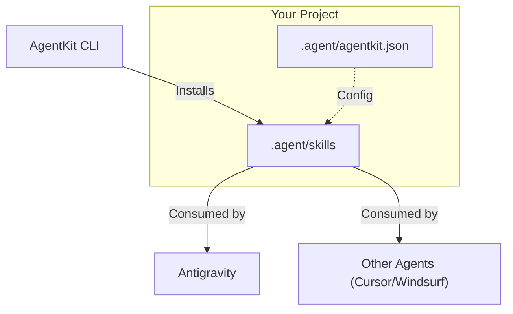

<div align="center">

<pre>
 █████╗  ██████╗ ███████╗███╗   ██╗████████╗██╗  ██╗██╗████████╗
██╔══██╗██╔════╝ ██╔════╝████╗  ██║╚══██╔══╝██║ ██╔╝██║╚══██╔══╝
███████║██║  ███╗█████╗  ██╔██╗ ██║   ██║   █████╔╝ ██║   ██║   
██╔══██║██║   ██║██╔══╝  ██║╚██╗██║   ██║   ██╔═██╗ ██║   ██║   
██║  ██║╚██████╔╝███████╗██║ ╚████║   ██║   ██║  ██╗██║   ██║   
╚═╝  ╚═╝ ╚═════╝ ╚══════╝╚═╝  ╚═══╝   ╚═╝   ╚═╝  ╚═╝╚═╝   ╚═╝   
</pre>

# @cgyudistira/agentkit

**The Enterprise-Grade Skill Manager for AI Code Agents**

<p>
  <a href="https://www.npmjs.com/package/@cgyudistira/agentkit"></a>
  <a href="https://nodejs.org"></a>
  <a href="https://www.npmjs.com/package/@cgyudistira/agentkit"></a>
  <a href="https://github.com/cgyudistira/agentkit"></a>
  <a href="https://opensource.org/licenses/MIT"></a>
</p>

<p>
  <a href="https://github.com/cgyudistira/agentkit/graphs/commit-activity"></a>
  <a href="http://makeapullrequest.com"></a>
  <a href="https://standardjs.com"></a>
</p>

</div>

---

## 📖 Table of Contents

- [Introduction](#-introduction)
- [Why AgentKit?](#-why-agentkit)
- [Architecture](#-architecture)
- [Quick Start](#-quick-start)
- [Skill Bundles (Personas)](#-skill-bundles-personas)
- [Workflows (Slash Commands)](#-workflows-slash-commands)
- [CLI Reference](#-cli-reference)
- [Programmatic API](#-programmatic-api)
- [Configuration](#-configuration)
- [Troubleshooting](#-troubleshooting)
- [Contributing](#-contributing)
- [License](#-license)

---

## 📖 Introduction

**AgentKit** is a standardized infrastructure layer that transforms generic AI code assistants (**Antigravity**, Cursor, Windsurf, Claude Code, Gemini) into specialized **Senior Engineering Partners**. 

Instead of relying on an AI's generalized training data—which often leads to hallucinated libraries, legacy patterns, or security flaws—AgentKit injects **315+ battle-tested engineering skills** directly into your agent's context. 

These skills act as **Standard Operating Procedures (SOPs)**, ensuring your AI agent follows strict, production-ready guidelines for everything from React Component architecture to OWASP security audits.

---

## 💡 Why AgentKit?

| Feature | Without AgentKit | With AgentKit |
|---|---|---|
| **Context** | Generic, often outdated training data | **Project-specific context & latest best practices** |
| **Consistency** | Varies by prompt phrasing | **Deterministically follows engineering standards** |
| **Complex Tasks** | Often gets lost in multi-step tasks | **Follows strict step-by-step Workflows** |
| **Security** | Frequently suggests vulnerable code | **Includes automated security auditing skills** |
| **Onboarding** | Requires manual prompt engineering | **Instant specialized persona setup** |

---

## 🏗️ Architecture

AgentKit integrates natively with Antigravity's `.agent` directory.



---

## 🚀 Quick Start

### 1. Installation

You can use AgentKit without installation via `npx`, or install it globally.

See [Getting Started Guide](docs/GETTING_STARTED.md) for detailed instructions.

```bash
# Recommended
npx @cgyudistira/agentkit

# Or Global Install
npm install -g @cgyudistira/agentkit
```

### 2. Interactive Setup

Run the command in your project root:

```bash
agentkit
```

The wizard will ask:
1.  **Select Your Agent**: Choose **Antigravity** (Recommended) or your preferred editor.
2.  **Select a Persona**: (e.g., `Full Stack Developer`).
3.  **Confirm**: Skills are downloaded to `.agent/skills` (for Antigravity/Windsurf) or `.cursor/skills`.

### 3. Usage (Antigravity Example)

Open your Antigravity Chat and ask:

> "I want to create a new user dashboard. Use the `/new-feature` workflow."

Antigravity will automatically detect the installed skills in `.agent/skills` and strictly follow the **Feature Implementation SOP**.

---

## 📦 Skill Bundles (Personas)

AgentKit allows you to install specific "Personas". Each bundle is a curated collection of skills.

### 💻 Full Stack Developer (`full-stack`)
*77 Skills* • Transforms your agent into a Senior Web Engineer.
- **Core**: React Patterns, Node.js Architecture, API Design (REST/GraphQL).
- **Frontend**: Tailwind Best Practices, State Management (Zustand/Redux), Accessibility (a11y).
- **Backend**: DB Schema Design (SQL/NoSQL), Caching Strategies (Redis), Auth Flow (JWT/OAuth).

### 🕵️ Security Expert (`security-expert`)
*46 Skills* • Essential for audits and hardening.
- **Auditing**: Automated Code Scanning, Dependency Analysis.
- **Defense**: OWASP Top 10 Mitigation, XSS/CSRF Prevention standards.
- **Crypto**: Proper Hashing (Argon2/Bcrypt), Encryption Standards (AES-256).

### 🤖 AI Engineer (`ai-engineer`)
*65 Skills* • For building LLM-powered apps.
- **Integration**: OpenAI/Anthropic SDKs, LangChain Patterns.
- **RAG**: Vector DB Setup (Pinecone/Milvus), Embedding Strategies.
- **Prompting**: Chain-of-Thought Optimization, System Prompt Engineering.

### 🦄 Startup Founder (`startup-founder`)
*25 Skills* • Product strategies and business logic.
- **Product**: MVP Scope Definition, User Story Mapping.
- **Biz**: Pitch Deck Generation, Market Analysis, Unit Economics.

### 📊 Data Scientist (`data-scientist`)
*18 Skills* • Intelligent Data Analysis & Visualization.
- **Analysis**: Pandas/NumPy best practices, Data Cleaning pipelines.
- **Vis**: Matplotlib/Seaborn charting, Interactive Dashboards (Streamlit).
- **Stats**: Hypothesis Testing, Regression Analysis, Time-series forecasting.

### ✍️ Content Writer (`content-writer`)
*34 Skills* • Technical Writing & SEO Optimization.
- **Docs**: API Reference (Swagger/OpenAPI), JSDoc/TypeDoc standards.
- **Marketing**: SEO-optimized Blog Posts, Release Notes generation.
- **Copy**: UX Writing, Landing Page conversion optimization.

### 🎨 Creative Studio (`creative-studio`)
*50 Skills* • Design & Asset Generation.
- **Assets**: SVG Icon generation, Favicon creation, 2D Game Sprites.
- **UI/UX**: Color Palette generation, Typography systems, Accessibility compliance.
- **Motion**: CSS Animations, Framer Motion patterns, Canvas API usage.

---

## 🔧 Workflows (Slash Commands)

Enhance your agent with **Standard Operating Procedures (SOPs)**. These workflows act as detailed checklists that your agent strictly follows.

| Command | Workflow | Description |
|---|---|---|
| `/new-feature` | **Feature Implementation** | End-to-end guide: Requirements → Design → Impl → Test. |
| `/code-review` | **Code Review** | rigorous checklist for performance, security, and styles. |
| `/debug` | **Systematic Debugging** | Step-by-step root cause analysis protocol. |
| `/refactor` | **Safe Refactoring** | Strategy to improve code without breaking functionality. |
| `/deploy` | **Deployment Checklist** | CI/CD validation, security checks, and release steps. |
| `/testing` | **Testing Strategy** | Unit, Integration, and E2E testing guidelines. |
| `/database-migration` | **DB Ops** | Safer schema changes and data migration plans. |
| `/git-workflow` | **Git Standards** | Commit hygiene, branching strategies, and PR etiquette. |

*Usage Example:*
> User: "I need to add a login page. Use `/new-feature`."
> Agent: "Understood. I will follow the feature implementation workflow. Step 1: Requirements..."

---

## 🛠️ CLI Reference

Full command-line interface documentation.

| Command | Arguments | Description |
|---|---|---|
| `agentkit` | *(none)* | Launch the interactive Setup Wizard. |
| `list` | `--skills` | List all bundles. Use `--skills` to see all 315+ skills. |
| `install` | `<bundle>` | Install a specific bundle (e.g., `agentkit install full-stack`). |
| | `<skill>` | Install a single skill (e.g., `agentkit install react-patterns`). |
| | `--all` | Install the entire library (315+ skills). |
| | `--out <path>` | Specify custom output directory. |
| `search` | `<query>` | Search for skills by keyword (e.g., `react`, `security`). |
| `doctor` | *(none)* | Diagnose installation issues and environment health. |
| `status` | *(none)* | Show current installation status and available agents. |

---

## 🔌 Compatibility

AgentKit is optimized for **Antigravity**, but supports all major AI editors.

| Agent | Type | Skills Path | Priority |
|---|---|---|---|
| **Antigravity** | **Native** | `.agent/skills/` | ⭐⭐⭐ |
| **Cursor** | IDE | `.cursor/skills/` | ⭐⭐ |
| **Windsurf** | IDE | `.agent/skills/` | ⭐⭐ |
| **Claude Code** | CLI | `.claude/skills/` | ⭐ |
| **Gemini CLI** | CLI | `.gemini/skills/` | ⭐ |
| **TRAE Code AI** | IDE | `.trae/skills/` | ⭐ |

---

## 💻 Programmatic API

You can use AgentKit internally in your own Node.js tools.

```javascript
const agentkit = require('@cgyudistira/agentkit');

// Install specific skills programmatically
await agentkit.commands.install('react-patterns', { out: './my-skills' });

// List available bundles
const bundles = await agentkit.utils.getBundles();
console.log(bundles['full-stack']);
```

---

## 📁 Project Structure

When installed, AgentKit creates a non-intrusive structure in your project:

```
my-project/
├── .agent/                  # AgentKit Core Directory
│   ├── skills/              # Installed Skills (Markdown files)
│   │   ├── react-patterns/
│   │   ├── security-audit/
│   │   └── ...
│   ├── workflows/           # Slash Command Workflows
│   │   ├── new-feature.md
│   │   └── ...
│   └── agentkit.json        # Configuration & Metadata
└── .cursorrules             # (If using Cursor) - References .agent/skills
```

---

## 📚 Documentation

Detailed documentation is available in the `docs/` directory:

- [Getting Started](docs/GETTING_STARTED.md) - Installation and first steps.
- [Skills Catalog](docs/SKILLS_CATALOG.md) - Full list of all 315+ skills.
- [Workflows Guide](docs/VISUAL_GUIDE.md) - Visual guide to slash commands.
- [Examples](docs/EXAMPLES.md) - Practical usage scenarios.
- [FAQ](docs/FAQ.md) - Frequently Asked Questions.
- [Security Policy](docs/SECURITY.md) - Reporting vulnerabilities.
- [Changelog](docs/CHANGELOG.md) - Version history.

---

## 🤝 Contributing

We welcome contributions! Please see our [Contributing Guide](docs/CONTRIBUTING.md) for details.

1. Fork the repository.
2. Create your feature branch (`git checkout -b feature/amazing-skill`).
3. Commit your changes.
4. Push to the branch.
5. Open a Pull Request.

---

## 📄 License

This project is licensed under the **MIT License**. See the [LICENSE](LICENSE) file for details.

---

<div align="center">

**Built with ❤️ for the AI Developer Community**  
*By [cgyudistira](https://github.com/cgyudistira)*

</div>
